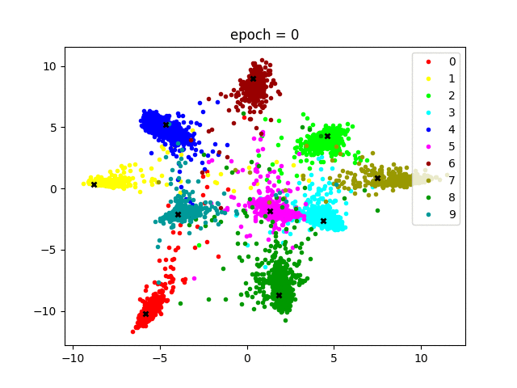

Here we aim to reproduce the MNIST results from [this paper](https://link.springer.com/chapter/10.1007/978-3-319-46478-7_31) via an implementation in Keras:

*Y. Wen, K. Zhang, Z. Li, and Y. Qiao, ‘A Discriminative Feature Learning Approach for Deep Face Recognition’, in Computer Vision – ECCV 2016, 2016, pp. 499–515.*

First we train a classifier using cross-entropy loss alone:

We then add the 'center loss term': 

