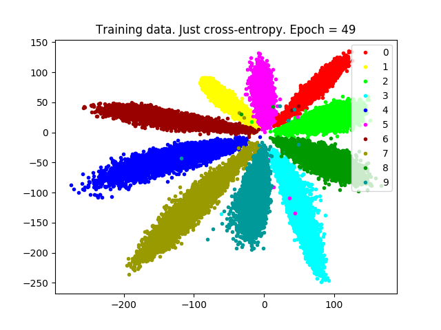
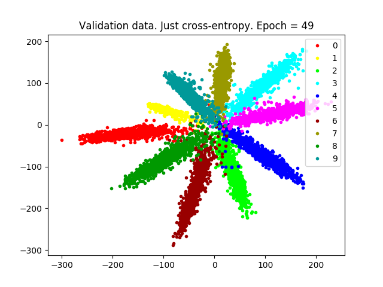
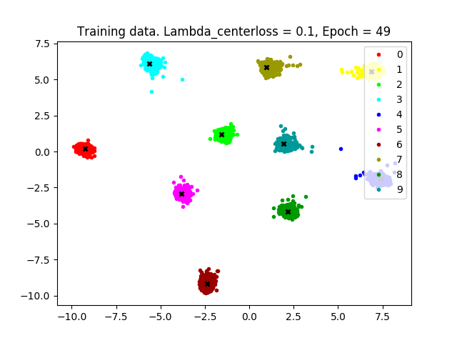

Here we aim to reproduce the MNIST results from [this paper](https://ydwen.github.io/papers/WenECCV16.pdf) via an implementation in Keras:

*Y. Wen, K. Zhang, Z. Li, and Y. Qiao, ‘A Discriminative Feature Learning Approach for Deep Face Recognition’, in Computer Vision – ECCV 2016, 2016, pp. 499–515.*

First we train a classifier using cross-entropy loss alone (basic_MNIST.py):

 

We then add the 'center loss term' (centerloss_MNIST.py):

 

---

The original authors implement in Caffe:

https://github.com/ydwen/caffe-face

Some other repos which are trying to do similar:

https://github.com/shamangary/Keras-MNIST-center-loss-with-visualization

https://github.com/EncodeTS/TensorFlow_Center_Loss (TensorFlow)

https://github.com/jxgu1016/MNIST_center_loss_pytorch (PyTorch)

